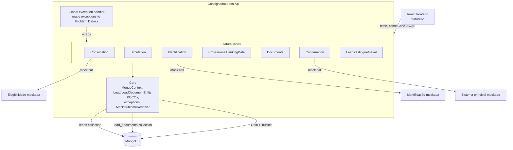

# Lead Recovery Design

**Spec**: `.specs/features/lead-recovery/spec.md`
**Status**: Approved

---

## Architecture Overview

Backend is organized as **vertical slices**, one folder per contract operation, on top of a thin shared Core (Mongo access, POCOs, exceptions, error middleware). No repository-per-entity abstraction and no mediator library — a slice's endpoint calls its own handler directly, which talks to MongoDB through a shared typed context. This keeps every endpoint's full request→validation→Mongo→response path readable in one folder (AD-001), while the only real cross-slice sharing is the Mongo collection accessors, the `Lead`/`LeadDocumentEntity` persistence models, and the exception→Problem-Details mapping.



Frontend mirrors the same idea: one folder per step under `src/features/`, each owning its page, its API calls, and its types; a small `src/shared/` holds the HTTP client, the lead-progress context, and the stepper/layout shell.

---

## Approach Considered (and why Vertical Slice + no mediator won)

| Approach | Trade-off | Verdict |
| --- | --- | --- |
| **Vertical slice, plain handlers (chosen)** | Some duplicated Mongo-filter code between slices; no pipeline behaviors | Fewest dependencies (only `MongoDB.Driver`, already referenced), each slice readable standalone, lowest risk for a 7-day Docker-built prototype |
| Vertical slice + MediatR (Command/Query + pipeline behaviors) | Extra dependency, more ceremony (marker interfaces, DI registration per handler) | Pays off only with many cross-cutting behaviors; this feature has one (Problem Details mapping), which a global exception handler covers without MediatR |
| Traditional layered (Controllers/Services/Repositories) | Repository-per-entity abstraction spreads a single endpoint's logic across 3+ files/layers | Rejected — conflicts with `AGENTS.md` (user-mandated vertical slice) and with AD-001 |

---

## Code Reuse Analysis

### Existing Components to Leverage

| Component | Location | How to Use |
| --- | --- | --- |
| `MongoDB.Driver` 3.10.0 package reference | `backend/src/ConsignadoLeads.Api/ConsignadoLeads.Api.csproj:10` | Already the only dependency; use its `IMongoClient`, `IMongoCollection<T>`, `GridFSBucket`, `Builders<T>.Filter/Update` — no new package needed for storage or GridFS |
| `/health` endpoint + CORS setup | `backend/src/ConsignadoLeads.Api/Program.cs:6-14` | Keep as-is; extend the same `Program.cs` as composition root that calls each slice's `MapXxxEndpoints()` |
| `ConnectionStrings__MongoDb` env var wiring | `docker-compose.yml` (api service) | Read via `builder.Configuration.GetConnectionString("MongoDb")` in `Program.cs`, no changes needed to compose |

### Integration Points

| System | Integration Method |
| --- | --- |
| MongoDB (`leads`, `lead_documents`, GridFS) | `Core/MongoContext` wraps `IMongoDatabase`, exposes typed collections + GridFS bucket; registered as singleton in DI |
| Elegibilidade / Identificação / Sistema principal (mocks) | Each lives inside its consuming slice (`Features/Consultation/EligibilityMock.cs`, `Features/Identification/IdentificationMock.cs`, `Features/Confirmation/MainSystemMock.cs`) — not shared, since each has a distinct outcome enum and no logic in common beyond the `mockOutcome`/`ENABLE_TEST_ENDPOINTS` gate, which is factored into `Core/MockOutcomeResolver` |
| Frontend ↔ API | Plain `fetch` wrapper in `frontend/src/shared/api/httpClient.ts`, base URL `http://localhost:8080` |

---

## Components

Every backend feature slice follows the same 3-file shape (pattern described once; representative paths below — the other slices repeat it):

- `{Feature}Endpoints.cs` — a `static class` with one `MapXxxEndpoints(this IEndpointRouteBuilder app)` extension, called from `Program.cs`. Declares the route(s), binds request DTOs, calls the handler, maps the result to the exact status code from the contract.
- `{Feature}Dtos.cs` — request/response DTO records for that slice only (never the Mongo POCO).
- `{Feature}Handler.cs` — plain class, constructor-injected `MongoContext` (+ `MockOutcomeResolver` where relevant), holds the business logic and the Mongo calls (`Builders<Lead>.Filter/Update`, `FindOneAndUpdateAsync`).

### Core/MongoContext

- **Purpose**: Single place that knows the collection/bucket names and exposes typed accessors.
- **Location**: `backend/src/ConsignadoLeads.Api/Core/MongoContext.cs`
- **Interfaces**:
  - `IMongoCollection<Lead> Leads { get; }`
  - `IMongoCollection<LeadDocumentEntity> LeadDocuments { get; }`
  - `GridFSBucket Files { get; }`
- **Dependencies**: `IMongoClient` (registered from `ConnectionStrings__MongoDb`), a `MongoClassMapInitializer` (camelCase convention pack) run once at startup.
- **Reuses**: `MongoDB.Driver` package already referenced.

### Core/Models — `Lead`, `LeadDocumentEntity`

- **Purpose**: Mongo persistence POCOs — never returned by an endpoint directly (AC LEAD-60, DTOs at the boundary).
- **Location**: `backend/src/ConsignadoLeads.Api/Core/Models/Lead.cs`, `LeadDocumentEntity.cs`
- **Shape**: mirrors the spec's `leads`/`lead_documents` schema (see Data Models below); nested types `Simulation`, `IdentificationData`, `ProfessionalData`, `BankingData`, `ConfirmationAttempt`, `FinalRegistration`, `Progress`.
- **Dependencies**: none beyond `MongoDB.Bson` attributes.

### Core/Exceptions

- **Purpose**: Distinct exception types per error family, so the global handler maps them to the right status without a generic catch-all (AC LEAD-56).
- **Location**: `backend/src/ConsignadoLeads.Api/Core/Exceptions/`
- **Types**: `LeadNotFoundException`, `DocumentNotFoundException` (→ 404); `VersionConflictException` (carries `CurrentVersion`), `ConfirmationInProgressException`, `LeadAlreadyCompletedException` (→ 409); `PendingRequirementsException` (carries the reasons list, → 422); `MainSystemUnavailableException` (→ 503); `MainSystemTimeoutException` (→ 504).
- **Reuses**: mapped centrally in `Core/ProblemDetailsExceptionHandler` (implements `IExceptionHandler`, registered via `AddExceptionHandler<T>()` + `AddProblemDetails()` — built into ASP.NET Core, no new package).

### Core/MockOutcomeResolver

- **Purpose**: Shared gate for the `mockOutcome`/`ENABLE_TEST_ENDPOINTS` pattern (AD applies to 3 slices with 3 different enums).
- **Location**: `backend/src/ConsignadoLeads.Api/Core/MockOutcomeResolver.cs`
- **Interfaces**: `TEnum Resolve<TEnum>(string? mockOutcome, TEnum deterministicDefault) where TEnum : struct, Enum` — reads `ENABLE_TEST_ENDPOINTS` from configuration once (singleton), parses `mockOutcome` only when the flag is `true` and the value is a valid `TEnum` member, otherwise returns `deterministicDefault`.
- **Reuses**: nothing external; pure config + enum parsing.

### Features/Consultation

- **Purpose**: `POST /leads/consultation` (create) + `PUT /leads/{id}/steps/consultation` (correct/re-run).
- **Location**: `backend/src/ConsignadoLeads.Api/Features/Consultation/`
- **Interfaces**: `ConsultationHandler.CreateAsync(CreateConsultationRequest)`, `ConsultationHandler.UpdateAsync(Guid id, UpdateConsultationRequest)`.
- **Dependencies**: `MongoContext`, `MockOutcomeResolver`, `EligibilityMock` (in-slice).
- **Reuses**: `Core` only.

### Features/Simulation

- **Purpose**: `POST /leads/{id}/steps/simulation`, `PATCH /leads/{id}/steps/simulation/{simulationId}/select`.
- **Location**: `backend/src/ConsignadoLeads.Api/Features/Simulation/`
- **Interfaces**: `SimulationCalculator.Calculate(decimal requestedAmount, int installments, decimal availableMargin)` (pure function — Price formula, unit-testable in isolation), `SimulationHandler.CreateAsync`, `SimulationHandler.SelectAsync`.
- **Dependencies**: `MongoContext`.
- **Reuses**: `Core`; `SimulationCalculator` has zero Mongo dependency by design so it's directly unit-testable (spec P1-2 Independent Test).

### Features/Identification

- **Purpose**: `PUT /leads/{id}/steps/identification`.
- **Location**: `backend/src/ConsignadoLeads.Api/Features/Identification/`
- **Dependencies**: `MongoContext`, `MockOutcomeResolver`, `IdentificationMock`.

### Features/ProfessionalBankingData

- **Purpose**: `PUT /leads/{id}/steps/professional-banking-data`.
- **Location**: `backend/src/ConsignadoLeads.Api/Features/ProfessionalBankingData/`
- **Dependencies**: `MongoContext`.

### Features/Documents

- **Purpose**: `POST/GET /leads/{id}/documents`, `DELETE /leads/{id}/documents/{documentId}`.
- **Location**: `backend/src/ConsignadoLeads.Api/Features/Documents/`
- **Interfaces**: `DocumentsHandler.UploadAsync(Guid leadId, IFormFile file, DocumentType type, PersonalDocumentSubtype? subtype)`, `.ListActiveAsync(Guid leadId)`, `.DeleteAsync(Guid leadId, Guid documentId)`.
- **Dependencies**: `MongoContext` (`LeadDocuments` collection + `Files` GridFS bucket).
- **Write order (no cross-collection transaction, standalone Mongo, AD-002/AD-004)**: 1) validate size/content-type before touching Mongo; 2) upload bytes to GridFS (`UploadFromStreamAsync`); 3) insert `lead_documents` metadata row referencing the returned `ObjectId`; 4) if a document of the same `type` already existed, mark it `replaced` in the same handler call (two sequential atomic single-document writes — acceptable since a crash between steps 2-3 only leaves an unreferenced GridFS blob, never a dangling/broken metadata row).

### Features/Confirmation

- **Purpose**: `POST /leads/{id}/confirm`, `POST /leads/{id}/retry-submission`.
- **Location**: `backend/src/ConsignadoLeads.Api/Features/Confirmation/`
- **Interfaces**: `ConfirmationHandler.ConfirmAsync(Guid id, ConfirmRequest)`, `ConfirmationHandler.RetrySubmissionAsync(Guid id)`, `PendingRequirementsValidator.Validate(Lead lead)` (pure function returning the reasons list — unit-testable).
- **Dependencies**: `MongoContext`, `MockOutcomeResolver`, `MainSystemMock`.
- **Mutex mechanic**: `FindOneAndUpdateAsync` filtered on `{_id, status: {$in: [allowed set]}}`, update sets `status="confirming"`. `MatchedCount == 0` after this call means either the lead doesn't exist (404) or a status not in the allowed set (409) — handler disambiguates with one extra `Leads.Find(_id).AnyAsync()` only on the miss path (avoids the extra read on the common success path).

### Features/Leads (listing/retrieval)

- **Purpose**: `GET /leads`, `GET /leads/{id}`.
- **Location**: `backend/src/ConsignadoLeads.Api/Features/Leads/`
- **Interfaces**: `LeadsHandler.ListAsync(LeadsQuery)`, `LeadsHandler.GetByIdAsync(Guid id)` (joins active `lead_documents` for the detail view).
- **Dependencies**: `MongoContext`.

### Frontend — `src/features/{step}/`

- **Purpose**: One folder per wizard step (`consultation`, `simulation`, `identification`, `professionalBankingData`, `documents`, `confirmation`), each with `{Step}Page.tsx`, `{step}Api.ts`, `{step}.types.ts`.
- **Location**: `frontend/src/features/`
- **Shared**: `frontend/src/shared/` — `api/httpClient.ts` (fetch wrapper, base URL + JSON handling + Problem Details error parsing), `leadContext.tsx` (current lead id + `progress` in React context, drives the stepper), `components/Stepper.tsx`, `components/LoadingError.tsx`.
- **Dependencies**: none beyond React 18 + Vite already scaffolded.

---

## Data Models

### `Lead` (collection `leads`, `_id` = string GUID)

```csharp
class Lead {
    string Id;                       // _id
    string Status;                   // enum as string
    int Version;
    int SchemaVersion;               // = 1
    Progress Progress;
    Consultation? Consultation;
    List<Simulation> Simulations;    // default: empty list, never null
    IdentificationData? Identification;
    ProfessionalData? ProfessionalData;
    BankingData? BankingData;
    Confirmation Confirmation;       // always present, fields inside start null/empty
    DateTime CreatedAt;
    DateTime UpdatedAt;
}

class Progress {
    string CurrentStep;
    List<string> StartedSteps;
    List<string> CompletedSteps;
    List<string> PendingItems;
    DateTime LastUpdatedAt;
}

class Simulation {
    string Id; decimal RequestedAmount; int Installments;
    decimal InterestRate; decimal InstallmentAmount; decimal TotalAmount;
    bool Selected; DateTime SimulatedAt;
}

class Confirmation {
    DateTime? ConfirmedAt;
    List<ConfirmationAttempt> Attempts;  // default: empty list
    FinalRegistration? FinalRegistration;
}
```

Fields not yet reached (`Identification`, `ProfessionalData`, `BankingData`, `Consultation` before creation) are absent from the BSON document (`[BsonIgnoreIfNull]`) — matches the spec's ausente/null/vazio convention (P1-8 AC6, README seção 6).

### `LeadDocumentEntity` (collection `lead_documents`)

```csharp
class LeadDocumentEntity {
    string Id;
    string LeadId;
    string Type;                    // personal_document | payslip
    string? PersonalDocumentSubtype;
    string Status;                  // pending|uploaded|validated|invalid|replaced|deleted
    string? Replaces;               // previous document id, if a reupload
    ObjectId GridFsFileId;
    string ContentType;
    long SizeBytes;
    DateTime UploadedAt;
}
```

**Relationships**: `LeadDocumentEntity.LeadId` references `Lead.Id` (application-level, no Mongo foreign key). `GridFsFileId` references the GridFS `fs.files`/`fs.chunks` collections managed by the driver's `GridFSBucket`.

---

## Error Handling Strategy

| Error Scenario | Handling | User Impact |
| --- | --- | --- |
| Lead/document not found | `LeadNotFoundException`/`DocumentNotFoundException` thrown from handler, caught by `ProblemDetailsExceptionHandler` | **404** Problem Details |
| `expectedVersion` mismatch | `VersionConflictException` (carries `CurrentVersion`) | **409** with `extensions.currentVersion` |
| Confirm/retry mutex miss (status not in allowed set) or already `completed` | `ConfirmationInProgressException` / `LeadAlreadyCompletedException` | **409** |
| Etapa 6 pendências | `PendingRequirementsValidator` returns non-empty list → `PendingRequirementsException` | **422** with the exact reasons |
| Mock `rejected`/`validationError` | `PendingRequirementsException`-style 422 raised from `ConfirmationHandler` after the mock call, lead set to `failed_retryable` first | **422**, lead preserved |
| Mock `unavailable` | `MainSystemUnavailableException` | **503**, lead preserved, `failed_retryable` |
| Mock `timeout` | `MainSystemTimeoutException` | **504**, lead preserved, `failed_retryable` |
| Mock `indeterminate` | No exception — handler returns 202 directly, `pending_verification` | **202** |
| Malformed/oversized upload | Validated before any Mongo/GridFS call, returns `Results.ValidationProblem`/`Results.Problem` directly (not exception-based, since it's a normal input-validation branch) | **400** |
| Unhandled exception | Falls through to ASP.NET Core's default problem-details fallback | **500** generic Problem Details |

---

## Risks & Concerns

| Concern | Location (file:line) | Impact | Mitigation |
| --- | --- | --- | --- |
| GridFS + metadata write not transactional (standalone Mongo, no sessions) | `Features/Documents/DocumentsHandler.cs` (to be created) | A crash between GridFS upload and metadata insert leaves an orphaned GridFS blob (harmless, unreferenced) — never the reverse (broken metadata pointing to a missing file), because metadata is written *after* the file is confirmed uploaded | Documented write order above; acceptable for a 7-day prototype, no cleanup job required for MVP |
| No `appsettings.json`/`launchSettings.json` exist yet in the skeleton | `backend/src/ConsignadoLeads.Api/` (absent) | Config today is 100% env-var driven (already how `docker-compose.yml` wires `ConnectionStrings__MongoDb`) | Keep it that way (matches NFR "configuração por ambiente"); add `appsettings.Development.json` only if local `dotnet run` (outside Docker) becomes a workflow |
| Confirm/retry mutex read-after-miss adds one extra query only on the 404-vs-409 disambiguation path | `Features/Confirmation/ConfirmationHandler.cs` (to be created) | Negligible — only hit on the failure path, not the common success path | No action needed |
| Skeleton has zero test project | `backend/ConsignadoLeads.slnx` | Tasks phase must include creating `ConsignadoLeads.Api.Tests` (xUnit) as its own task before any test-writing task | Flagged here so Tasks phase doesn't silently skip it |

---

## Tech Decisions (only non-obvious ones)

| Decision | Choice | Rationale |
| --- | --- | --- |
| Camelcase Mongo field mapping | `ConventionPack` with `CamelCaseElementNameConvention`, registered once at startup | Matches contract JSON casing directly, avoids per-field `[BsonElement]` attributes everywhere |
| DTO ↔ POCO mapping | Hand-written mapping methods per slice (no AutoMapper) | Small, explicit shapes per slice; one more dependency isn't worth it at this scale |
| `IExceptionHandler` for Problem Details | Built-in ASP.NET Core 8+/10 `AddProblemDetails()` + `IExceptionHandler`, no custom middleware pipeline | Framework-native, zero extra package, satisfies RFC 9457 shape out of the box |
| Validation | Manual guard clauses per handler (no FluentValidation) | Request shapes are small and fixed by contract; a validation library adds a dependency without saving much code here |

Project-level decisions from this design were already appended to `.specs/STATE.md` as AD-001..AD-004.
